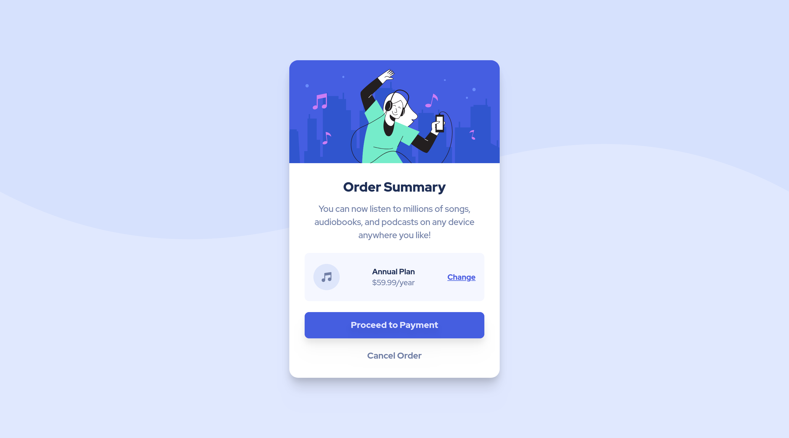

# Frontend Mentor - Order summary card solution

This is a solution to the [Order summary card challenge on Frontend Mentor](https://www.frontendmentor.io/challenges/order-summary-component-QlPmajDUj). Frontend Mentor challenges help you improve your coding skills by building realistic projects. 

## Table of contents

- [Overview](#overview)
  - [The challenge](#the-challenge)
  - [Screenshot](#screenshot)
  - [Links](#links)
- [My process](#my-process)
  - [Built with](#built-with)
  - [What I learned](#what-i-learned)
- [Author](#author)

**Note: Delete this note and update the table of contents based on what sections you keep.**

## Overview

### The challenge

Users should be able to:

- See hover states for interactive elements

### Screenshot



### Links

- Solution URL: [GitHub Repo](https://github.com/JustinByrne/FM-order-summary-component/)
- Live Site URL: [GitHub Page](https://justinbyrne.github.io/FM-order-summary-component/)

## My process

### Built with

- Semantic HTML5 markup
- CSS custom properties
- Flexbox
- CSS Grid
- Mobile-first workflow
- [Tailwind CSS](https://tailwindcss.com/) - CSS framework
- [Browser-Sync](https://browsersync.io/) - Browser Hot Reload

### What I learned

One of the things that I learnt and will take with me is the ability to extend the `backgroundImage` theme config and add in background images.

```js
backgroundImage: {
    mobile: "url('./images/bg-mobile.svg')",
    desktop: "url('./images/bg-desktop.svg')",
  }
```

## Author

- Website - [JRLByrne Tech](https://tech.jrlbyrne.com)
- Frontend Mentor - [@JustinByrne](https://www.frontendmentor.io/profile/JustinByrne)
- Twitter - [@JustinBTechGuy](https://www.twitter.com/JustinBTechGuy)